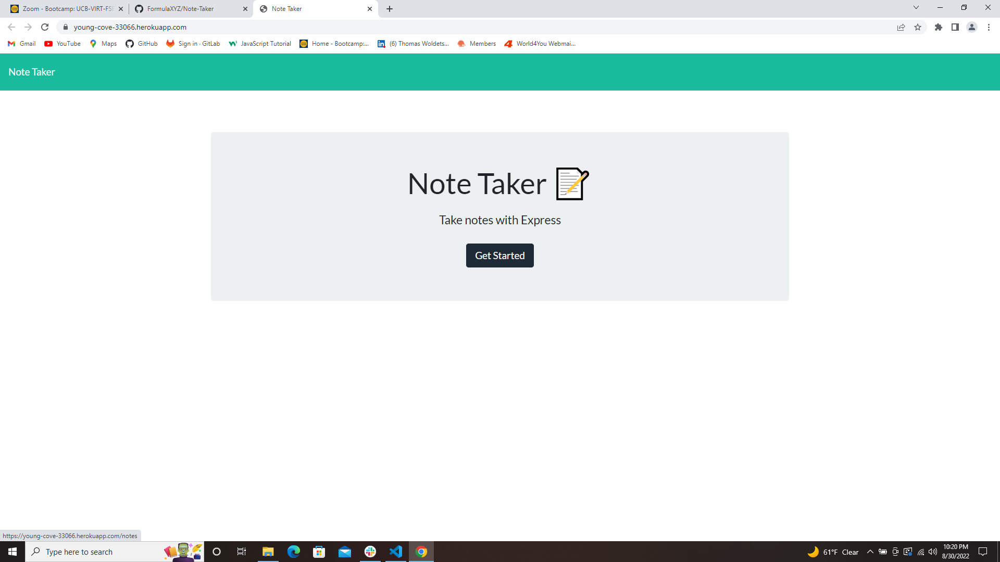
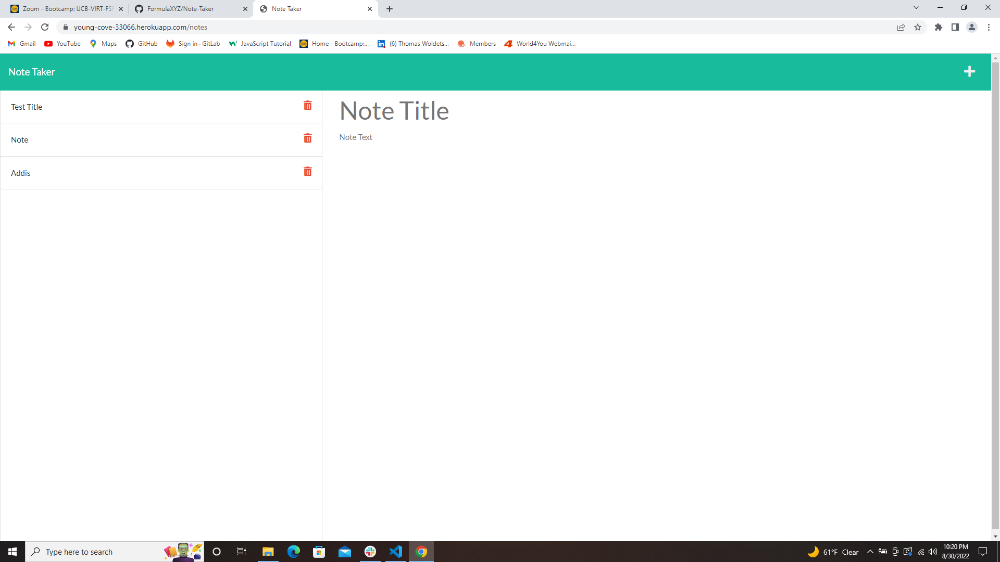

[heroku Link](https://young-cove-33066.herokuapp.com/)

# Express.js: Note Taker

## Discription

  
  
This application was created by modifiying a starter code to create an application called Note Taker that can be used to write and save notes. This application  uses an Express.js back end and will save and retrieve note data from a JSON file.

 the  front end was already been created. I build the back end, connect the two, and then deployed the entire application to Heroku.

## Uses 

  A small business owner  wants to be able to write and save notes.SO THAT the user can organize  thoughts and keep track of tasks that need to complete.

   a note-taking application,WHEN the user open the Note Taker the user presented with a landing page with a link to a notes page,WHEN the user click on the link to the notes page, the user presented with a page with existing notes listed in the left-hand column, plus empty fields to enter a new note title and the note’s text in the right-hand column.when the user enter a new note title and the note’s text,then a Save icon appears in the navigation at the top of the page.when the user click on the Save icon.then the new note the user entered is saved and appears in the left-hand column with the other existing notes.when the user click on an existing note in the list in the left-hand columnthen that note appears in the right-hand column.when the user click on the Write icon in the navigation at the top of the pagethen the user presented with empty fields to enter a new note title and the note’s text in the right-hand column.
